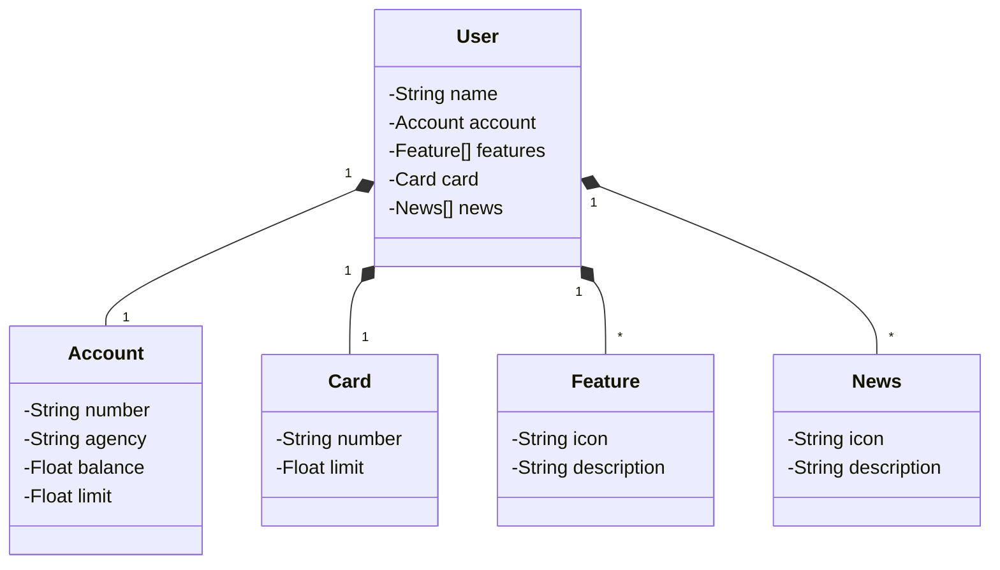

# API RESTful Sistema Bancário
API RESTful Java que realiza operações de Get e Post em um Usuário que possuí uma Conta com algumas características.

Neste código foi Implentada uma APIRESTful com tratamento de exceções, Autenticação Básica para controle e acesso usando o banco de dados em memória H2.

# Diagrama de Classes

## Technologias Utilizadas:    
- Spring Boot
- Spring Web
- Open API Swagger
- JPA
- Hibernate
- Spring Security
- Gradle
